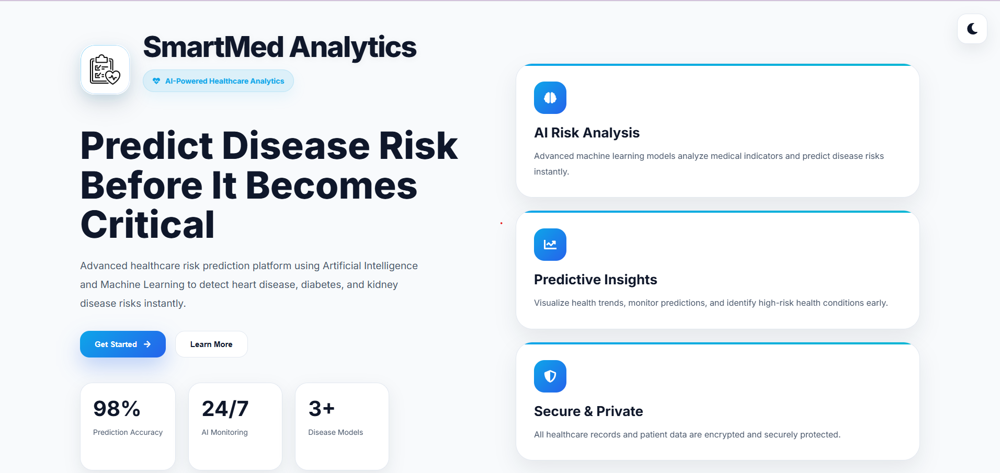
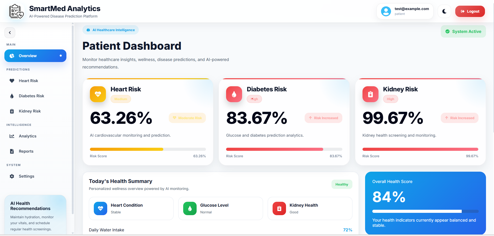
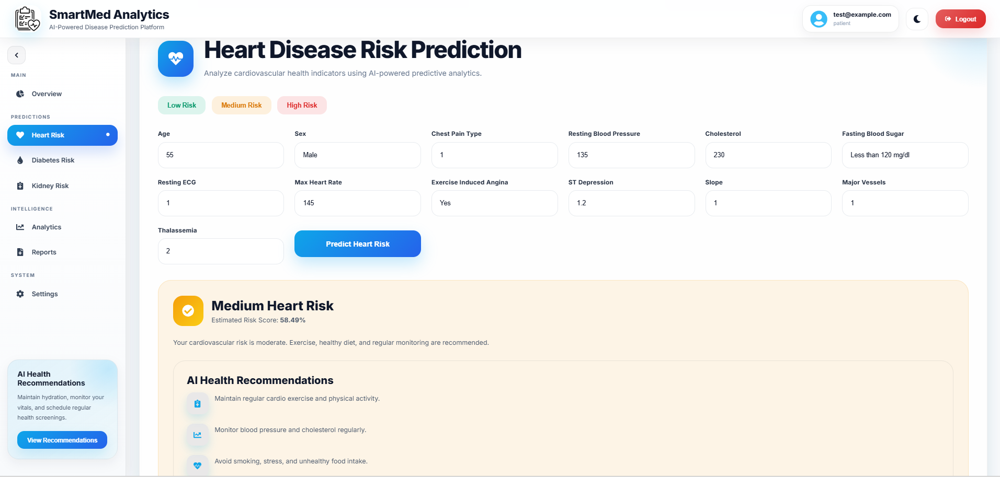
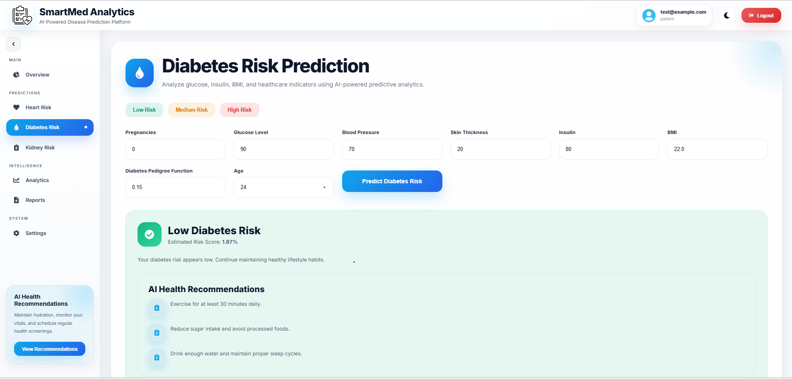
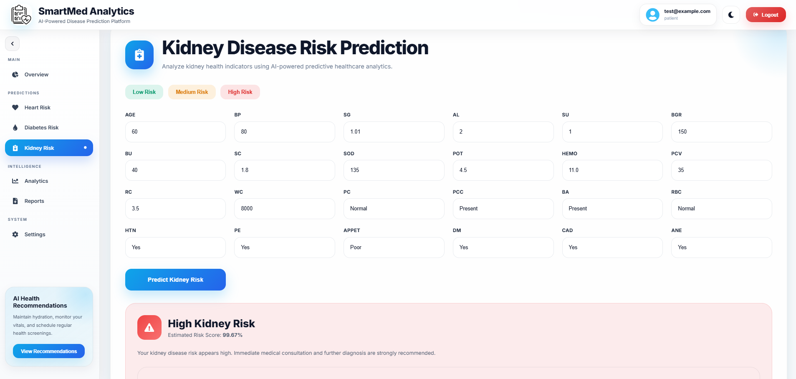

# SmartMed Analytics

SmartMed Analytics is a web-based healthcare platform that uses machine learning to predict the risk of heart disease, diabetes, and kidney disease. It was built to make health risk assessment easier and more accessible for both patients and doctors.

Instead of just giving a prediction, the platform also explains *why* the prediction was made, tracks your health score over time, and gives personalized recommendations on what to do next (like which specialist to visit or what diet to follow).

The project also includes an AI chatbot ("Healthcare Copilot") that can answer health questions, explain medical terms from uploaded reports, and help you understand your results in plain language.

---

## Features

- **Disease Risk Prediction** – Predict the risk of heart disease, diabetes, and kidney disease using ML models trained on real medical datasets
- **Medical Report Upload** – Upload PDF or image reports; the system reads and extracts health parameters using OCR
- **Health Score** – Get a single overall health score (0–100) based on your predictions, BMI, blood pressure, age, and lifestyle
- **AI Healthcare Copilot** – A chatbot powered by OpenAI that answers health questions, explains reports, and gives suggestions
- **Personalized Recommendations** – Receive diet plans, exercise guidance, medication reminders, and doctor referrals based on your risk levels
- **PDF Health Reports** – Download a detailed PDF summary of your health score, predictions, and recommendations
- **Health Timeline** – View your past health scores, predictions, and report uploads in a timeline view
- **Admin Dashboard** – View overall platform stats like total users, prediction counts, and disease distribution
- **Voice Assistant** – Use voice input to chat with the AI Copilot
- **Blood Pressure Tracker** – Log and track your BP readings over time
- **Specialist Finder** – Get recommendations for nearby doctors based on your health needs
- **Dark/Light Theme** – Toggle between dark and light mode

---

## Technologies Used

- **Frontend**: React (v19), React Router, Recharts (charts), Framer Motion (animations), Axios, jsPDF, React Hot Toast, React Icons
- **Backend**: Python Flask, Flask-JWT-Extended (authentication), Flask-CORS, PyMongo, OpenAI API
- **Machine Learning**: scikit-learn (Random Forest), SHAP (model explainability), Pandas, NumPy, Joblib
- **Database**: MongoDB
- **PDF/Image Processing**: PyPDF2, pdfplumber, pytesseract (OCR), Pillow
- **PDF Generation**: ReportLab
- **Styling**: Tailwind CSS (via CDN in the React app), custom CSS

---

## Project Structure

```
healthcare-risk-prediction/
├── backend/
│   ├── app.py                  # Main Flask application (entry point)
│   ├── config.py               # Configuration settings (DB, JWT, API keys)
│   ├── admin/
│   │   └── routes.py           # Admin stats endpoints
│   ├── analytics/
│   │   └── routes.py           # Platform analytics endpoints
│   ├── auth/
│   │   ├── models.py           # User model helper
│   │   └── routes.py           # Register/Login endpoints
│   ├── copilot/
│   │   └── routes.py           # AI Copilot chat endpoints
│   ├── health/
│   │   └── routes.py           # Health score, recommendations, timeline endpoints
│   ├── ml/
│   │   ├── loaders.py          # Load saved ML models
│   │   ├── pipelines.py        # (empty - models built separately)
│   │   ├── train_heart.py      # Train heart disease model
│   │   ├── train_diabetes.py   # Train diabetes model
│   │   ├── train_kidney.py     # Train kidney disease model
│   │   └── train_models.py     # Unified training script
│   ├── models/
│   │   └── health_models.py    # Data models for health records & scores
│   │   └── report_models.py    # Data models for reports & health scores
│   ├── prediction/
│   │   └── routes.py           # Disease prediction endpoints
│   ├── premium/
│   │   └── routes.py           # Premium features (PDF, diet, doctors)
│   ├── reports/
│   │   └── routes.py           # Report upload & analysis endpoints
│   ├── services/
│   │   ├── base_service.py           # Base service class
│   │   ├── health_score_service.py   # Health score calculation
│   │   ├── report_analysis_service.py # Extract data from medical reports
│   │   ├── recommendations_service.py # Generate health recommendations
│   │   ├── explainability_service.py # Explain predictions using SHAP
│   │   ├── copilot_service.py        # AI Copilot (chatbot)
│   │   ├── premium_services.py       # PDF generation, diet plans, doctors
│   │   └── analytics_service.py      # Platform analytics
│   └── tests/
│       └── test_ml_loaders.py
│       └── test_explainability_service.py
├── frontend/
│   ├── public/
│   │   ├── screenshots/        # App screenshots
│   │   └── index.html
│   └── src/
│       ├── App.js              # React app with routing
│       ├── api/
│       │   └── client.js       # Axios API client
│       ├── components/         # Reusable UI components
│       │   ├── AppShell.jsx    # Main app layout with sidebar
│       │   ├── Navbar.jsx
│       │   ├── Sidebar.jsx
│       │   ├── HealthScore.jsx # Animated health score ring
│       │   ├── PredictHeart.jsx
│       │   ├── PredictDiabetes.jsx
│       │   ├── PredictKidney.jsx
│       │   ├── ReportUpload.jsx
│       │   ├── HealthcareCopilot.jsx
│       │   ├── ProtectedRoute.jsx
│       │   └── ...more
│       ├── context/            # React context for theme & recommendations
│       └── pages/
│           ├── Landing.jsx           # Landing/home page
│           ├── Login.jsx & Register.jsx
│           ├── PatientDashboard.jsx  # Main patient dashboard
│           ├── AdminDashboard.jsx    # Admin analytics dashboard
│           ├── ReportsPage.jsx       # Upload & view reports
│           ├── CopilotPage.jsx       # AI chatbot page
│           ├── AnalyticsPage.jsx     # Personal health analytics charts
│           ├── RecommendationsPage.jsx
│           ├── DietPlanPage.jsx
│           ├── ExerciseGuidePage.jsx
│           ├── BPTrackerPage.jsx
│           └── SettingsPage.jsx
├── models/                     # Saved ML models (.pkl files)
│   ├── heart_pipeline.pkl
│   ├── diabetes_pipeline.pkl
│   └── kidney_pipeline.pkl
├── datasets/                   # Training datasets (CSV)
│   ├── heart.csv
│   ├── diabetes.csv
│   └── kidney_disease.csv
├── uploads/                    # Uploaded medical reports
├── requirements.txt            # Python dependencies
├── train_models.py             # Train all three models at once
├── .env.example                # Environment variables template
└── tailwind.config.cjs
```

---

## Installation

### Prerequisites

- Python 3.10+
- Node.js 18+
- MongoDB (running locally or a cloud instance)
- Tesseract OCR (optional, for report image OCR)

### Step 1 – Clone the repository

```bash
git clone <your-repo-url>
cd healthcare-risk-prediction
```

### Step 2 – Set up the backend

```bash
# Create a virtual environment
python -m venv .venv

# Activate it
# Windows:
.venv\Scripts\activate
# macOS/Linux:
source .venv/bin/activate

# Install Python packages
pip install -r requirements.txt
```

### Step 3 – Set up environment variables

Copy the example file and fill in your values:

```bash
cp .env.example .env
```

Edit `.env` and at least set:
- `MONGO_URI` – your MongoDB connection string
- `OPENAI_API_KEY` – your OpenAI API key (for the Copilot feature)
- `SECRET_KEY` and `JWT_SECRET_KEY` – random strings for security

### Step 4 – Train ML models

```bash
python train_models.py
```

This trains all three models (heart, diabetes, kidney) and saves them inside the `models/` folder.

### Step 5 – Set up the frontend

```bash
cd frontend
npm install
```

### Step 6 – Run the application

**Start the backend** (from the project root):

```bash
python backend/app.py
```

The backend runs at `http://127.0.0.1:5000`.

**Start the frontend** (in a separate terminal):

```bash
cd frontend
npm start
```

The frontend runs at `http://localhost:3000`.

---

## How to Use

1. Open the app in your browser at `http://localhost:3000`
2. **Create an account** by clicking Register and filling in your email and password
3. **Log in** with your new account
4. On the dashboard, you'll see your health score and different prediction tabs:
   - Click **Heart**, **Diabetes**, or **Kidney** to enter your health data and get a risk prediction
   - The prediction shows your risk level (Low / Medium / High) and explains which factors matter most
5. **Upload medical reports** under the Reports section – the system will extract readings automatically
6. **Chat with the AI Copilot** to ask questions about your health
7. **View recommendations** for diet, exercise, and doctor visits
8. **Download a PDF report** under Premium features
9. **Admins** can visit `/admin` to see overall platform statistics

---

## User Roles

### Patient
- Can predict disease risks
- Upload and analyze medical reports
- View personal health score and history
- Chat with the AI Healthcare Copilot
- Receive diet plans, exercise guides, and doctor recommendations
- Download PDF health reports

### Admin
- View total number of users, predictions, and reports on the platform
- See disease distribution across all users
- Monitor high-risk patients
- Access platform analytics and KPIs

---

## Screenshots

Add screenshots of your app in this section. Place image files in `frontend/public/screenshots/`.

| Page | Screenshot |
|------|-----------|
| Landing Page |  |
| Dashboard |  |
| Heart Prediction |  |
| Diabetes Prediction |  |
| Kidney Prediction |  |

---

## Future Improvements

- **More disease models** – Add prediction for more conditions like liver disease, cancer, or respiratory issues
- **Multi-language support** – Make the app available in different languages
- **Mobile app** – Build a companion mobile app using React Native
- **Appointment booking** – Allow users to book doctor appointments directly through the platform
- **Wearable device integration** – Connect with smartwatches and fitness trackers for real-time health data
- **Improved OCR accuracy** – Handle more report formats and handwritten text better
- **Notifications** – Send email or SMS reminders for medication and checkups

---

## Security Features

- **JWT Authentication** – Secure login and API access
- **Protected Routes** – Dashboard and admin pages require authentication
- **Encrypted Passwords** – User passwords stored using bcrypt hashing

---

## Author

**Vaishnavi Dasyam** – vaishnavi.41469@gmail.com

---

## License

This project is developed for educational and healthcare analytics purposes.
